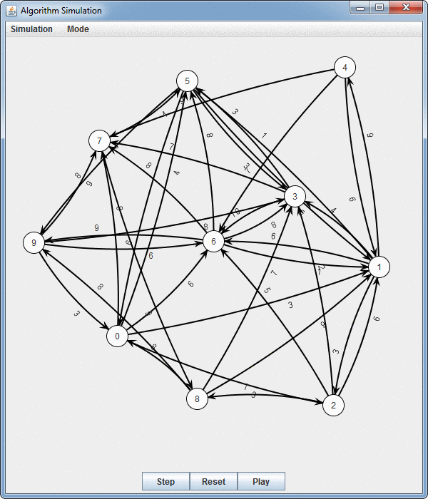

# Graph Algorithm Simulator

CS 310 Programming Assignment 4 Due: **May 5th** (**Saturday**) 11:59pm, 2019

## Quick Links
1. [Task Overview and Schedule](#tasks-overview)
2. [Examples Page](EXAMPLES.md)
4. [Task Details](TASKS.md)
5. [Rules Page](RULES.md)
6. [Submission Instructions](RULES.md#submission-instructions)
7. [Grading Rubric Page](GRADING.md)

## Assignment Objectives
- Write a program which simulates Dijkstra's shortest path algorithm on a graph.
- Create and use a _graph_ data structure.
- Apply basic knowledge of Big-O trade offs.

## Assignment Overview
Professional code often uses existing libraries to quickly prototype interesting programs. You are going to use 2-3 established libraries to quickly develop the internal representation of an advanced data structure (a graph) and simulate a simple graph algorithm. This GUI can be easily extended to other types of algorithms you might encounter in the future (such as in CS483), and you may find it useful to simulate later algorithms you learn using this same framework.

The three libraries you are going to use are:
1. Your previous project code - You have written a number of simple data structures in this class and you are welcome to continue using these as part of this project.
2. The Java Collections Framework - This is a collection of existing simple data structures (lists, queues, sets, maps, etc.) which can form the basis for more advanced data structures.
3. A subset of [JUNG](http://jung.sourceforge.net/) (Java Universal Network/Graph Framework) - This library provides a lot of cool visualization tools for graphs: automatic layouts for graphs, an easy interface for creating/editing graphs, and much more.

## Tasks Overview

There are **5** tasks in this assignment. It is suggested that you implement these tasks in the given order:

- Task 1: Examine the JCF Classes (0%)
- Task 2: Read the Provided Code Base (0%)
- Task 3: Implement a Directed Graph Class to Support the Simulator (50%)
- Task 4: Implement Dijkstra's Shortest Path Algorithm in the Simulator (45%)
- Task 5: Runtime Write-up (5%)

See the [Examples Page](EXAMPLES.md "") for what the simulator should be able to do when you are done, and then see the [Task Details Page](TASKS.md "") for a walk-through of each specific task.

Need a schedule?
- You've got 3.5 weeks.
- You have other classes with final exams/projects.
- Assume you want to spend the last week doing the EC and getting additional help.
- Keeping those things in mind, fill in the following:
  - Week 0 (4/12-4/14): _______________________________ (first weekend)
  - Week 1 (4/15-4/21): _______________________________
  - Week 2 (4/22-4/28): _______________________________
  - Week 3 (4/29-5/05): _______________________________ (extra credit for early submission...)

## Rules and Grading
As with all projects in CS310, we have some rules (see [Rules Page](RULES.md "")) and a grading rubric (see [Rubric Page](GRADING.md "")).
